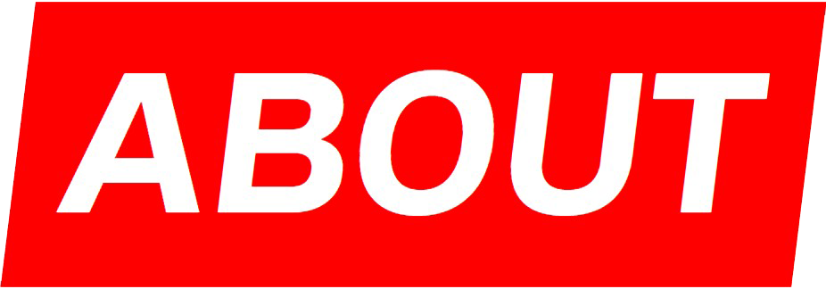
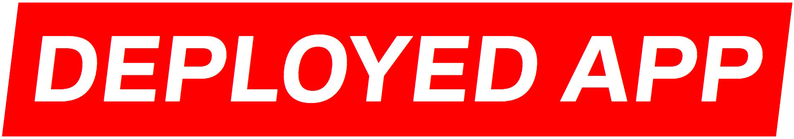

        

<h3 align="center">I am a Full-Stack Engineer Looking for a good job.</h3>

___

 
<ul>
<li>🔭 I am currently working with <strong>JavaScript, Gatsby, React.js, GraphQL, Headless CMS, Progressive Images, Scoped CSS, & Serverless Functions.</strong>
</li>
 
<li>👨🏽‍💻 I have just finished a project featuring <strong>JavaScript, Gatsby, React.js, GraphQL, Next.js, Apollo Client, & Jest/Enzyme test frameworks.</strong> (Check it out below)
</li>
</ul>

    
    

    
    

