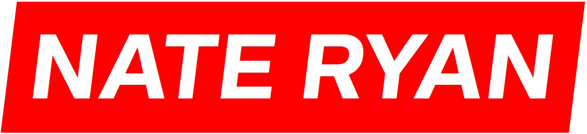
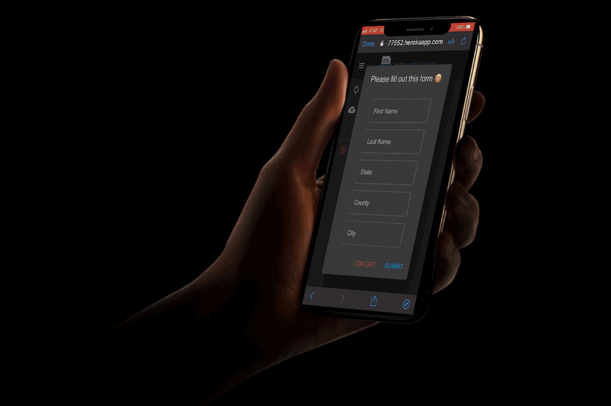
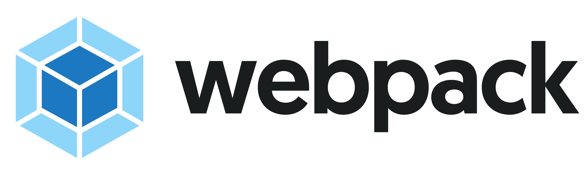
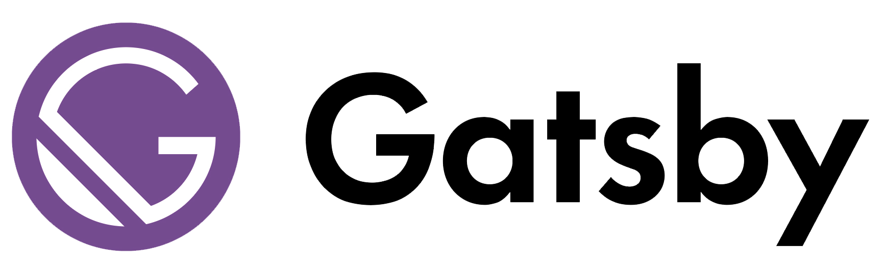
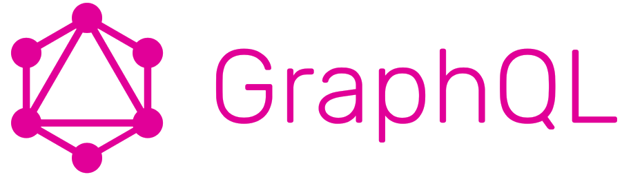
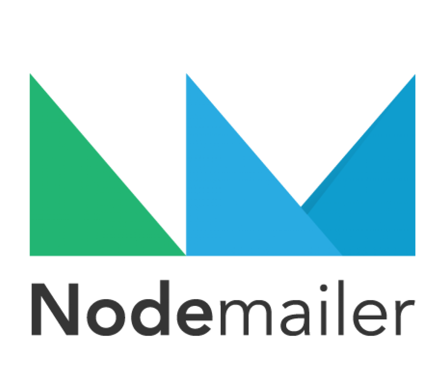
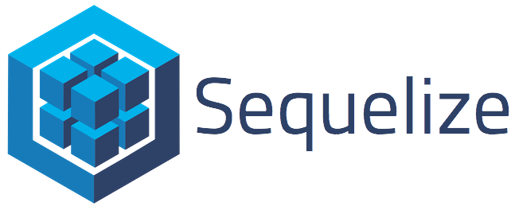
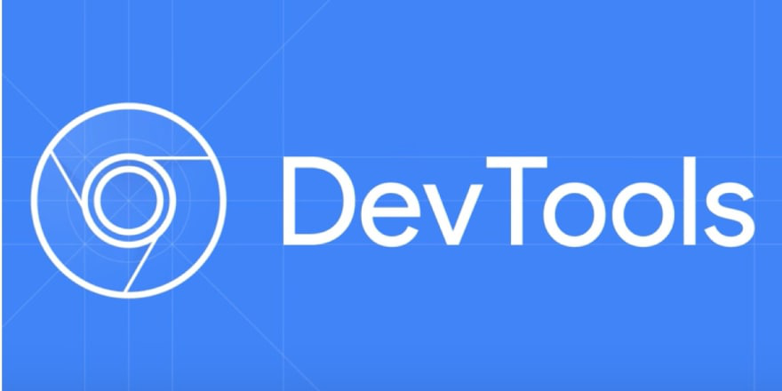

        

<h3 align="center">I am a Full-Stack Engineer Looking for a good job.</h3>

---

 

<h2 align="center">
    🏆 2nd Place in <a href="https://developerweek-2021-hackathon.devpost.com/">Anvil Challenge</a> for DeveloperWeek 2021 🏆
</h2>

    

    (click image to see repo)

 

👨🏽‍💻 I have just finished one project featuring <strong>ES6 JavaScript, Gatsby, React.js, GraphQL, Headless CMS, Progressive Images, Scoped CSS, Serverless Functions.</strong> I also I have another featuring <strong>ES6 JavaScript, React.js, GraphQL, Next.js, Apollo Client, & Jest/Enzyme test frameworks.</strong> (Check them out below)

    
    

    
    
    
    

 

---

 
<h3 align="center">I work with a ton of different programming languages and tools, most notably</h3> 

    <a href="https://nathanryan.tech/#skills">
        
        
        
        
        
        
        
        
        
        
        
        
        
        
        
        
        
        
        
        
        
        
        
        
        
        
        
        
        
        
        
        
        
        
        
        
        
    </a>

But please keep in mind, I am always up to a new challenge! 😃

 

---

<h2 align="center">Hey, lets connect.</h2>

| <a href="tel:5035047581">(503)504-7581</a> ||  <a href="mailto:nathanieljryan1994@gmail.com">nathanieljryan1994@gmail.com</a> || <a href="https://www.linkedin.com/in/nathanieljryan/">LinkedIn</a> || <a href="https://nathanryan.tech/">Portfolio</a> || <a href="https://nathanryan.tech/document/NathanielRyanResume.pdf">Resume</a> |

